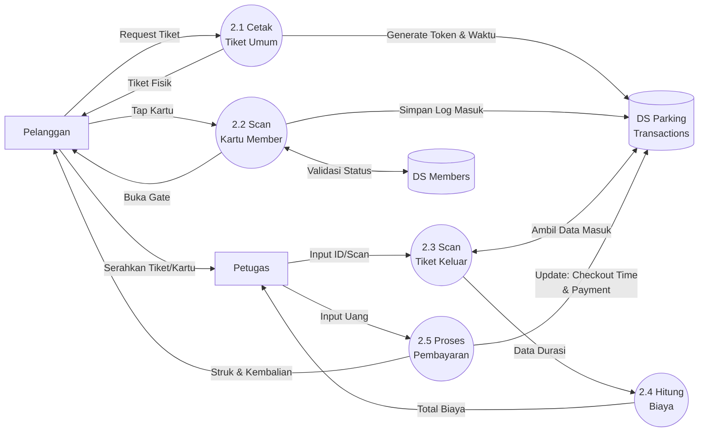
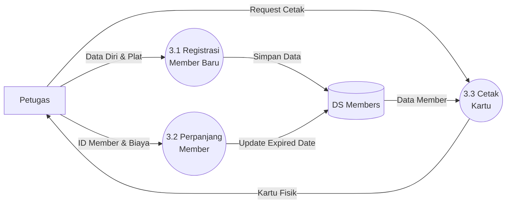
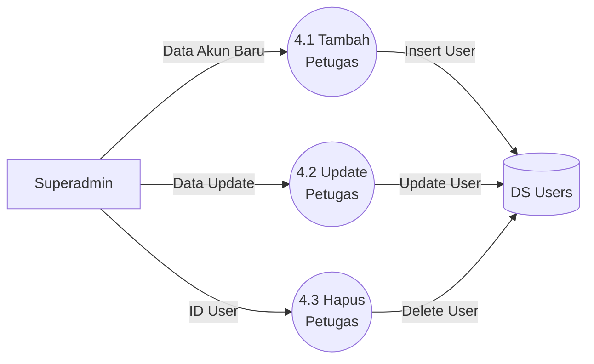

# Data Flow Diagram (DFD) Level 2 - Sistem ParkirKita

Dokumen ini menjabarkan DFD Level 2 untuk setiap proses utama dalam sistem ParkirKita. DFD Level 2 memberikan pandangan yang lebih rinci tentang bagaimana data mengalir dan diproses dalam sub-sistem.

## Simbol yang Digunakan
*   **Entitas Luar (External Entity):** Pengguna sistem (Pelanggan, Petugas, Superadmin).
*   **Proses (Process):** Aktivitas yang mengubah data.
*   **Data Store:** Tempat penyimpanan data (Tabel Database).
*   **Alur Data (Data Flow):** Perpindahan informasi antar komponen.

---

## 1. DFD Level 2: Proses 1.0 - Login & Autentikasi

Proses ini menangani validasi akses pengguna ke dalam sistem.

```mermaid
graph LR
    %% Entities
    User[User/Petugas/Admin]

    %% Processes
    P1_1((1.1 Input<br/>Kredensial))
    P1_2((1.2 Validasi<br/>User))
    P1_3((1.3 Cek<br/>Role))
    P1_4((1.4 Set<br/>Session))

    %% Data Stores
    DS_User[(DS Users)]

    %% Flows
    User -->|Email & Password| P1_1
    P1_1 -->|Data Login| P1_2
    P1_2 <-->|Cek Data User| DS_User
    P1_2 -->|Data Valid| P1_3
    P1_2 -->|Data Invalid (Error)| User

    P1_3 -->|Role: Superadmin| P1_4
    P1_3 -->|Role: Petugas| P1_4
    P1_4 -->|Akses Dashboard| User
```

**Penjelasan:**
*   **1.1 Input Kredensial:** User memasukkan email dan password di halaman login.
*   **1.2 Validasi User:** Sistem memeriksa kecocokan data dengan tabel `users`.
*   **1.3 Cek Role:** Jika valid, sistem memisahkan alur berdasarkan hak akses (Superadmin/Petugas).
*   **1.4 Set Session:** Sistem menyimpan ID dan Role ke dalam session browser.

---

## 2. DFD Level 2: Proses 2.0 - Transaksi Parkir

Proses inti yang mencakup kendaraan masuk (tiket/member) dan kendaraan keluar (pembayaran).



**Penjelasan:**
*   **2.1 Cetak Tiket Umum:** Membuat record baru di `parking_transactions` dengan `parking_token` unik.
*   **2.2 Scan Kartu Member:** Memvalidasi status member di `members` sebelum mencatat transaksi masuk.
*   **2.4 Hitung Biaya:** Mengkalkulasi durasi (Waktu Keluar - Waktu Masuk). Gratis untuk member, tarif progresif untuk umum.
*   **2.5 Proses Pembayaran:** Mengupdate record transaksi dengan `check_out_time`, `total_fee`, dan `cash_paid`.

---

## 3. DFD Level 2: Proses 3.0 - Manajemen Member (Oleh Petugas)

Proses pengelolaan data anggota parkir langganan.



---

## 4. DFD Level 2: Proses 4.0 - Manajemen Petugas (Oleh Superadmin)

Proses administrasi user yang dilakukan oleh Superadmin.


