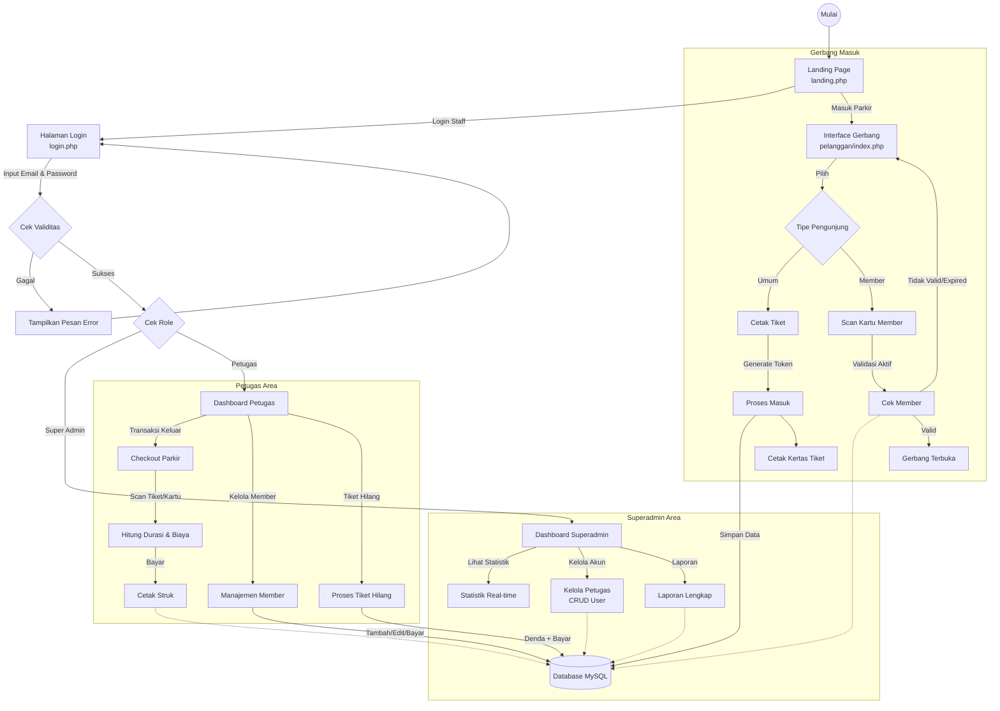

# Alur Sistem ParkirKita

Berikut adalah dokumentasi alur kerja sistem ParkirKita, mencakup proses Login, Operasional Petugas/Admin, dan Alur Masuk Pelanggan.

## Diagram Flowchart

## Penjelasan Alur Sistem

### 1. Alur Login & Autentikasi
*   **Akses Awal:** Pengguna mengakses `landing.php` yang menampilkan informasi umum.
*   **Login (`login.php`):** Staff (Petugas/Admin) memasukkan email dan password.
*   **Logika Validasi:**
    *   **Jika Gagal:** Sistem akan menampilkan pesan error "Kombinasi Email atau Password salah!" dan **tetap berada di halaman login** agar pengguna dapat mencoba lagi.
    *   **Jika Sukses:** Sistem mengarahkan pengguna ke dashboard sesuai perannya (`superadmin` atau `petugas`).

### 2. Alur Pelanggan (Masuk Parkir)
Pelanggan berinteraksi dengan Kiosk/Gerbang di `pelanggan/index.php`:
*   **Pengunjung Umum:** Menekan tombol "Cetak Tiket". Sistem membuat token unik, mencatat waktu masuk, dan mencetak tiket.
*   **Member:** Melakukan scan kartu. Sistem memvalidasi status member. Jika aktif, palang dibuka dan transaksi dicatat.

### 3. Alur Petugas (Operasional)
Petugas mengelola transaksi di `petugas/dashboard.php`:
*   **Checkout:** Memindai tiket keluar. Sistem menghitung durasi dan biaya secara otomatis.
*   **Manajemen Member:** Mendaftarkan dan memperbarui data member.
*   **Tiket Hilang:** Memproses denda khusus bagi pengunjung yang kehilangan tiket.

### 4. Alur Superadmin (Manajemen)
Superadmin memiliki kontrol penuh di `superadmin/dashboard.php`:
*   **Monitoring:** Melihat statistik pendapatan dan okupansi parkir real-time.
*   **Manajemen User:** Mengelola akun petugas yang memiliki akses login.
*   **Laporan:** Mengunduh laporan keuangan dan aktivitas operasional.
